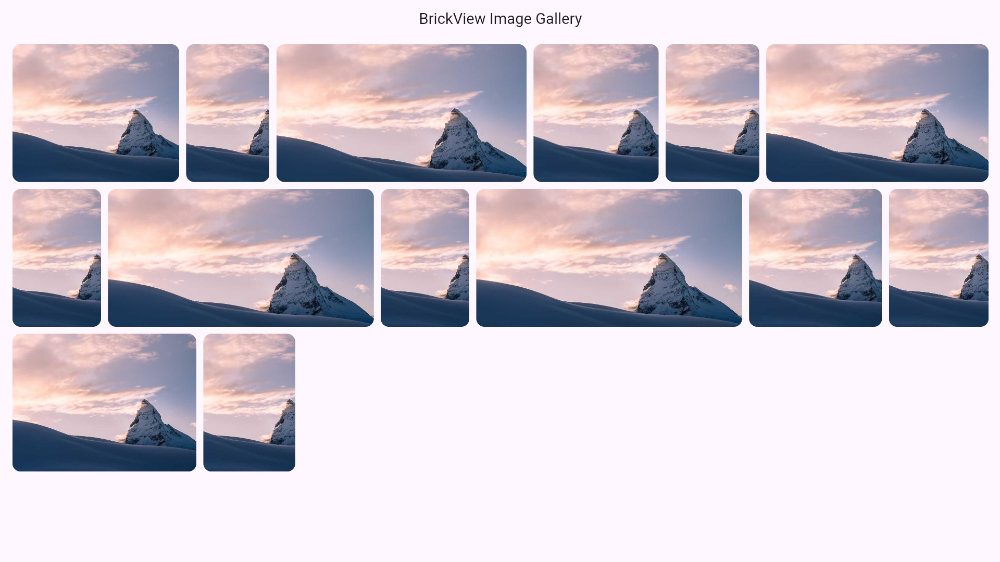

# Flutter Brick View

Flutter Brick View is a light weight package that allows developer to display network images in a brick view. It provides responsive layouts with customizable spacing, max_height, and smooth scrolling.


# Installation

Add this to your `pubspec.yaml`

```yaml
dependencies:
  flutter_brick_view: ^1.0.2
```

# Usage

```dart
import 'package:flutter_brick_view/flutter_brick_view.dart';

BrickView(
  imageUrls: imageUrls, // image url list
  maxHeight: 200,
  horizontalGap: 10,
  verticalGap: 10,
  padding: const EdgeInsets.symmetric(horizontal: 10),
  borderRadius: 12,
  loadingWidget: const Center(
    child: CircularProgressIndicator(color: Colors.orangeAccent),
  ),
  errorWidget: Container(
    color: Colors.grey[700],
    child: const Icon(Icons.broken_image, color: Colors.red),
  ),
  onImageTap: (index) {
    debugPrint('Tapped image at index: $index');
  },
),

```

## Screenshot


